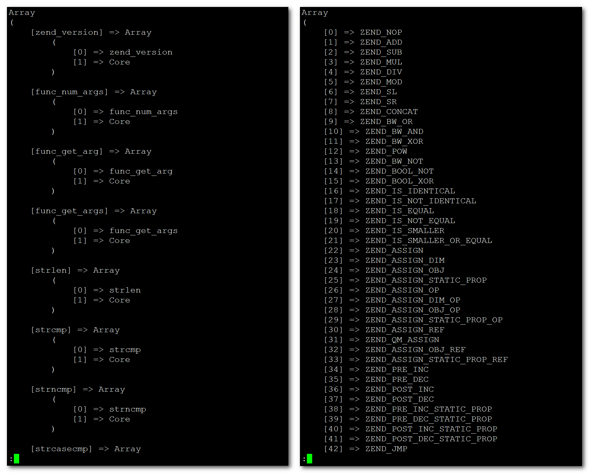

# ZendToolbox

`ZendToolbox`是一个纯C实现的PHP扩展：

* 作为辅助工具箱，主要提供贴近PHP内核层面的功能。
* 作为虎哥原创视频《深入PHP内核源码》的样板扩展。 
* 支持PHP7以上的所有版本，windows平台可用性未知。


## 基础功能

* 根据指定函数名获取其所隶属的PHP模块或ZEND模块。           
* 获取指定PHP版本下ZEND虚拟机支持的所有opcode指令。      


## 快速安装

假定PHP版本为 `PHP-8.2.12`，PHP内核源码目录为 `/data/software/src/php-8.2.12`

```
$ cd /data/software/src/php-8.2.12/ext/
$ git clone  https://github.com/blogdaren/ZendToolbox
$ cd ZendToolbox
$ /usr/local/php82/bin/phpize
$ ./configure --with-php-config=/usr/local/php82/bin/php-config 
$ make && make install
$ echo "extension=toolbox.so" >> /usr/local/php82/lib/php.ini
```

## 基础API

* 根据函数名获取其所隶属的PHP模块含ZEND模块：           
```
Toolbox::getPHPModuleByFunction(([ string $function_name ]) : array|string 
```

```
PHP内核以及三方扩展库为PHP上层提供了很多函数，这些函数都是由相应的PHP模块实现的，为了了解某个函数的实现原理，
首先需要快速地定位出其所隶属的PHP模块，进而快速定位出其相应的扩展源码；如果省略函数名，默认返回所有的PHP模块。
```

* 获取指定PHP版本下ZEND虚拟机支持的所有opcode指令：      
```
Toolbox::getZendVMOpcodes( void ) : array
```

```
获取ZEND虚拟机支持的所有opcode指令，默认获取的是当前PHP版本下的所有指令，也可以通过配置参数
ini_set("toolbox.php_src", "/root/path/to/your/php-src") 来获取指定PHP版本下的所有指令。 
```

* 获取ZendToolbox扩展本身的版本号：
```
getToolboxVersion( void ) : string
```

## 示例代码
```php
<?php
//ini_set("toolbox.php_src", "/root/path/to/your/php-src"/*默认不需要配置*/); 
Toolbox::getPHPModuleByFunction("date");
Toolbox::getPHPModuleByFunction("strpos");
$toolbox = new Toolbox();
$toolbox->getPHPModuleByFunction("posix_kill");
$toolbox->getPHPModuleByFunction("gettoolboxversion");
$toolbox->getPHPModuleByFunction("getToolboxVersion");
$toolbox->getZendVMOpcodes();
$toolbox->author = "phpcreeper";
$toolbox->setWebsite("http://www.phpcreeper.com");
$toolbox->getWebsite();
print_r(Toolbox::getPHPModuleByFunction());
print_r(Toolbox::getZendVMOpcodes());
print_r(getToolboxVersion().PHP_EOL);
print_r($toolbox);
```

## Screenshot


## 扩展开发启示录

* **扩展开发重要吗？**     

当然！PHP扩展最直接的两个用途分别是：`性能提升`和`安全加密`，当然远不止这些，毕竟是游走在C/C++/汇编层面，可塑性极高。我们都知道PHP扩展是
以动态共享库形式加载到PHP内核运作起来的，而且通过扩展提供的函数和类及方法绕过了耗时的`局部编译`和`局部执行`阶段，所以性能相对较高，
这是本质所在。再来看workerman内核实现，虽然是纯PHP实现，但是核心依赖有两个非常重要的PHP扩展`posix`和`pcntl`，如果没有这两个扩展，workerman将无法运行。
再来看swoole内核实现，swoole本身就是一个基于C/C++实现的PHP扩展，所以能够操控PHP内核的若干细节以及利用C/C++库以及汇编的生态实现更为强大的功能，
甚至改写Zend引擎的运作方式等等。再来看鸟哥的Yaf框架，Yaf是一款纯C实现的PHP框架，同时也是一个PHP扩展实现，以下摘自鸟哥YAF手册原话：

> 剑的三层境界：一是手中有剑，心中亦有剑；二是手中无剑，心中有剑；三是手中无剑，心中亦无剑。     
> Yaf就是剑的第二层境界，框架不在你手中，而在PHP的"心"中。     

所以说扩展开发的重要性不言而喻，主要还是因为有些时候PHP内核提供的功能受限，导致PHP上层开发力不从心，
还好得益于PHP内核优秀的模块化插件设计思想，使我们得以藉由C/C++层的扩展开发来扩充实现更为强大的功能。

* **那扩展开发难吗？**       

挺难！主要难在：

> 【1】需要熟练掌握PHP内核中大量的Zend API，个人认为API的分类管理有些凌乱，尤其是宏API和函数API，另外数量繁多，所以熟练掌握的成本比较高。      
> 【2】需要考虑到各个平台以及各个PHP版本的兼容性，实践中发现主要是高版本的PHP内核有定期移除旧的API，也有变更相同API的参数类型等等，所以兼容性实现费神。    
> 【3】需要高度警惕各种潜在的内存泄露，这个不仅仅是C程序本身层面的泄露，更是PHP内核层面的泄露，比如何时增加引用计数，何时减少引用计数，这个需要扩展开发作者自行管理，这是个难点！！个人认为如果对PHP内核没有深刻的了解和认识的话，这个将难以正确决策，大家可以参看本扩展的源码注释提示做实验，一旦误用就会报告各种错误如：`memory leaks` or `zend_mm_heap corruputed` or `assert failed` 等等，重点是要弄明白：何时增加引用计数，何时减少引用计数，务必做到心中有数。       


## 程序员虎哥小站

* [http://www.phpcreeper.com](http://www.phpcreeper.com)

